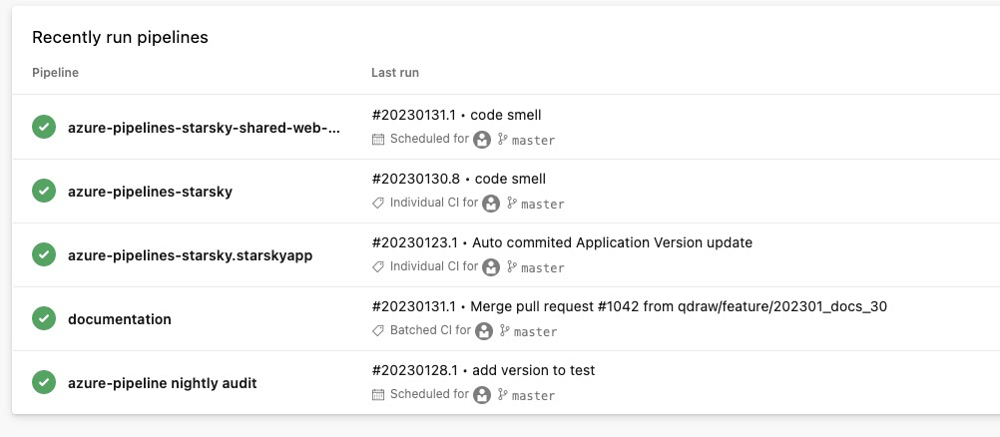

# Azure Devops

Azure DevOps is a cloud-based platform for development teams to collaborate on software development projects. 
It provides a comprehensive set of tools for planning, development, testing, and deployment of software applications. 
The platform integrates with a variety of tools and services, including source code management, 
continuous integration/continuous deployment (CI/CD) pipelines, and testing tools. 

In this project the Azure Devops is **private** and used to build the application for internal usage.
However the yaml files are public and can be used as a reference for other projects.
It is not needed to use Azure Devops for this project. All the build steps can be done via [Github Actions](../github-actions/readme.md).

## Azure Devops pipelines

The figure below shows the pipelines that are used in this project. The following pipelines are private:

### azure-pipelines-starsky

This is the main pipeline for building the application. This builds the server and client application.
So **no** desktop application is build. This is referenced by: `pipelines/azure/develop-ci.yml`

The following variables are used:

- `$(STARSKY_SONAR_KEY)` - project key for sonarcloud
- `$(STARSKY_SONAR_LOGIN)` - login key for sonarcloud
- `$(STARSKY_SONAR_ORGANISATION)` - organisation in sonarcloud

### azure-pipelines-starsky-shared-web-only 

For building for Azure there is a pipeline that builds the application with a shared .NET runtime.
This is referenced by: `pipelines/azure/shared-web-only.yml` and uses no variables used

### azure-pipelines-starsky.starskyapp

For build the desktop application there is a pipeline that builds the application .NET runtime.
This is referenced by: `pipelines/azure/app-ci.yml` and uses no variables used.

### documentation
Build documentation site. This is referenced by: `pipelines/azure/documentation.yml` 

The following variables are used:

- `$(baseUrl)` - at the moment is this: `/`
- `$(googleVerification)` - googleVerification key, starts with `google`
- `$(gTag)` - google analytics key, starts with `G-`
- `$(url)` - domain of docs site currently: `https://docs.qdraw.nl`

### azure-pipeline nightly audit

For auditing the project there is a pipeline that runs every night.
This is referenced by: `pipelines/azure/nightly-ci.yml` and uses no variables used.