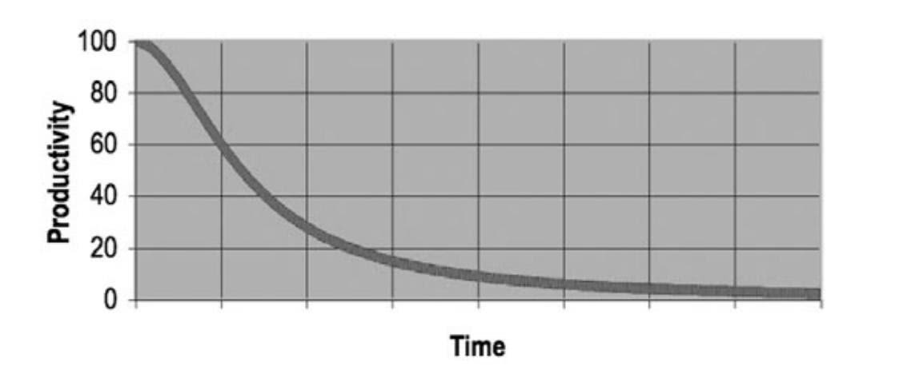
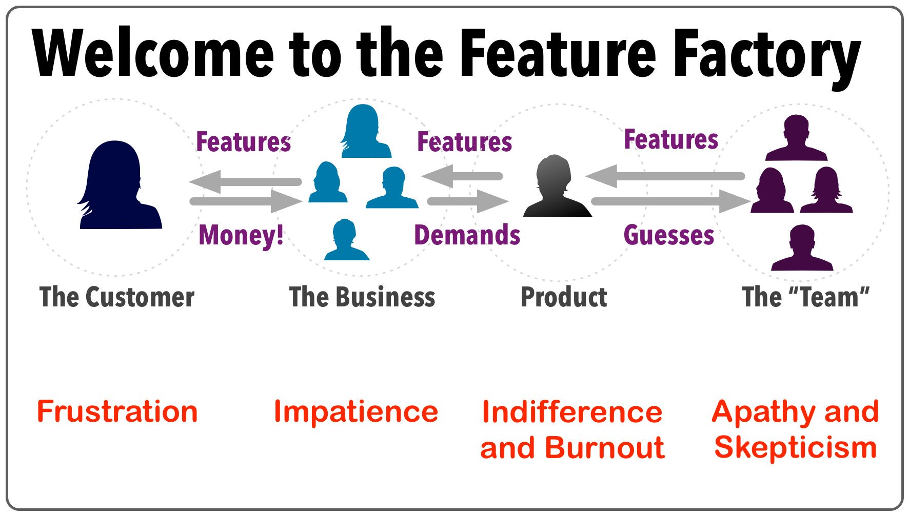

# Quality and Best Practices

**The quality of code has a practical impact on both your agility and the cost of development:** [^1]

- you can't change buggy and/or bloated code fast enough to be truly agile
- existing bugs can easily increase development costs (and time) by 10x
- the mess eventually becomes so big and so deep that you cannot clean it up anymore [^2]

>  All developers with more than a few years experience know that previous messes slow them down. And yet all
developers feel the pressure to make messes in order to meet deadlines. In short, they don’t take the time
to go fast! You will not make the deadline by making a mess. Indeed, the mess will slow you down instantly, and
will force you to miss the deadline. — <cite>Robert C. Martin</cite>

## Bottom-Up Development ##

Breaking a problem down into small, coherent fragments lends itself to organization. Start with the basic low-level
components and then proceed to higher-level abstractions.

Bottom-up development emphasizes coding and early testing, which can begin before having a detailed understanding 
of the final system. In practice, this may never be the case as requirements are constantly evolving.

Advantages of the bottom-up approach are component reusability, agility, and testability. 

> I compared Mel's hand-optimized programs with the same code massaged by the optimizing assembler program, 
> and Mel's always ran faster.
That was because the “top-down” method of program design hadn't been invented yet, and Mel wouldn't have used it anyway.
He wrote the innermost parts of his program loops first. 
> — <cite>[The Story of Mel](http://www.catb.org/jargon/html/story-of-mel.html)</cite>

## Opportunistic Refactoring ##

We encourage developers to refactor existing code when they notice a specific issue, 
even though this may seem difficult when working with a distributed team, branches, 
and pull requests due to potential merge conflicts and delayed feedback.

It is best to do this while you are working on the same component anyway, 
for example to implement a feature or enhancement. 
This way you can easily validate if the proposed changes make sense and you avoid conflicts with others.

Releasing imperfect code is not a problem as long as it is 
[accompanied by automated tests](#code-that-cannot-be-tested-is-flawed). 
This makes it easy to refactor later without breaking anything or requiring detailed knowledge of the requirements 
and a lot of time for manual testing. Be pragmatic. Done is better than perfect.

Potential [security issues](security/readme.md) are an important exception. These should **never** be ignored. 
If you find a problem, please [report it to us](security/readme.md) immediately so we can fix it.

>   Feel free to think ahead, just don't code ahead. But also, don't feel the need to decide so many
    details ahead. Learn enough to get started and build only what you need.
    — <cite>[J. B. Rainsberger](https://twitter.com/jbrains/status/1064212803542818816)</cite>

## Premature Optimization ##

One of the hardest parts of software development is knowing what to work on.
Don't get carried away implementing unnecessary abstractions and focusing on scalability 
optimization before you've even validated the functionality of a feature or component.

Instead of spending a lot of time on something you may not need, 
focus on user needs and [test automation](#code-that-cannot-be-tested-is-flawed).
That way, you'll make sure you're developing the right functionality, 
and you can [refactor it later](https://martinfowler.com/bliki/DefinitionOfRefactoring.html) for scalability 
and other non-functional aspects without breaking anything.

Also keep in mind that it's much easier and less effort to maintain small amounts 
of duplicate code than to choose the wrong abstraction.

 > Premature optimization is the root of all evil. — <cite>Donald Knuth</cite>

## Be Careful with Caching ##

There are two hard things in computer science: [cache invalidation](https://msol.io/blog/tech/youre-probably-wrong-about-caching/) and naming things.

> A cache is just a memory leak you haven't met yet. — <cite>Dave Cheney</cite>

## Go Slow Before You Go Fast 🐰 ##

Read the docs, understand the context, and talk to others to gather missing information before you start coding. Write tests. Stay focused.

Don't worry that this will take too long. Take your time. It's the fastest and only sustainable way to get things done. You have to go slow before you can go fast.

 > Simple, elegant solutions are [more effective](#effectiveness-efficiency), 
 > but they are harder to find than complex ones, and they require more
time, which we too often believe to be unaffordable. 
 > — <cite>Niklaus Wirth, [Communications of the ACM](https://dl.acm.org/doi/10.1145/2786.2789), 1985</cite>

## Effectiveness > Efficiency ##

Optimize for effectiveness before efficiency when prioritizing tasks:

- **Effectiveness** is about achieving a specific outcome, such as providing the features that best help users solve their problems.
- **Efficiency** means doing things in an optimal way, for example, faster and cheaper. We all strive to be efficient, but that's worthless if it doesn't contribute to effectiveness.

In contrast, a feature factory focuses on the quantity of new features rather than their quality:

*Source: [John Cutlefish](https://twitter.com/johncutlefish/status/780102280162840576)*

> **It is fundamentally the confusion between effectiveness and efficiency that stands between doing the right **
> **things and doing things right.** There is surely nothing quite so useless as doing with great 
> efficiency what should not be done at all. — <cite>[Peter Drucker](https://en.wikipedia.org/wiki/Peter_Drucker)</cite>

## Test Automation Guidelines ##

We strive for [complete test coverage](https://martinfowler.com/bliki/TestCoverage.html) as it is a useful tool for finding
untested parts of our code base. Test coverage is of limited use as a numerical statement of how good our tests are.

The *F.I.R.S.T. Principle* includes five rules that good tests should follow:

- **Fast.** If tests are slow, you won't run them frequently, which makes them much less useful and increases 
  the cost of development. 
- **Independent.** You should be able to run each test independently and run the tests in any order you like. 
  When tests depend on each other, then the first one to fail causes a cascade of downstream failures, 
  making diagnosis difficult and hiding downstream defects. 
- **Repeatable.** If your tests aren’t repeatable in any environment, then you’ll always have an excuse for why they fail. 
  You’ll also find yourself unable to run the tests when the environment isn’t available. 
- **Self-Validating.** You should not have to read through a log file to tell whether the tests pass. If the tests aren’t
  self-validating, then failure can become subjective and running the tests can require a long manual evaluation. 
- **Timely.** If you write the tests after the production code, you will generally 
  find that the production code is difficult to test. Instead, add tests at implementation time to ensure that the 
  code is testable, does what you expect it to do, and meets the requirements.

> Code that cannot be tested is flawed. — <cite>Anonymous</cite>

## Code Quality Reports ##

We use SonarQube to scan our code for quality issues and to generate reports.
And CodeQL to scan for security issues.

## Security Best Practices ##

The [Open Source Security Foundation](https://bestpractices.coreinfrastructure.org/en/) (OpenSSF) 
maintains standardized security criteria and best practices for open-source projects:

## References ##

[^1]: Allen Holub, [*twitter.com/allenholub/status/1073738216140791808*](https://twitter.com/allenholub/status/1073738216140791808), 2018
[^2]: Robert C. Martin, [*Clean Code: A Handbook of Agile Software Craftsmanship*](https://www.amazon.com/-/dp/0132350882/), 2009