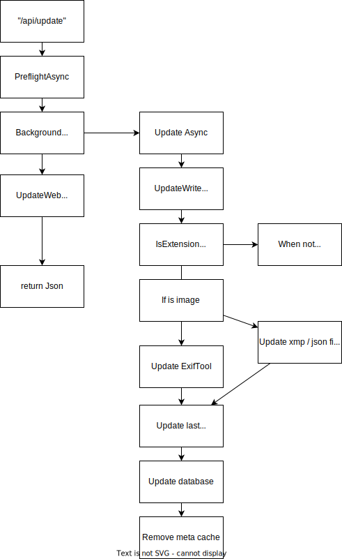

# Update API

The Update API that updates the metadata of an image and updates the database can be a powerful tool for managing large collections of images. 
With this API, users can update information such as image titles, descriptions, tags, and other metadata directly. 
The API can also automatically update the corresponding records in a database, allowing for easy retrieval and management of image metadata.

This kind of API can be particularly useful for businesses that rely heavily on images, such as stock photo websites or e-commerce platforms that sell products with multiple images. By updating image metadata and database records in real-time, businesses can ensure that their image collections remain organized and up-to-date, saving time and reducing errors.

Overall, an API that updates image metadata and database records can greatly improve the efficiency and effectiveness of image management for businesses of all kinds. By streamlining the process of updating image metadata, this API can help users quickly find and use the images they need, ultimately leading to improved productivity and better results.

