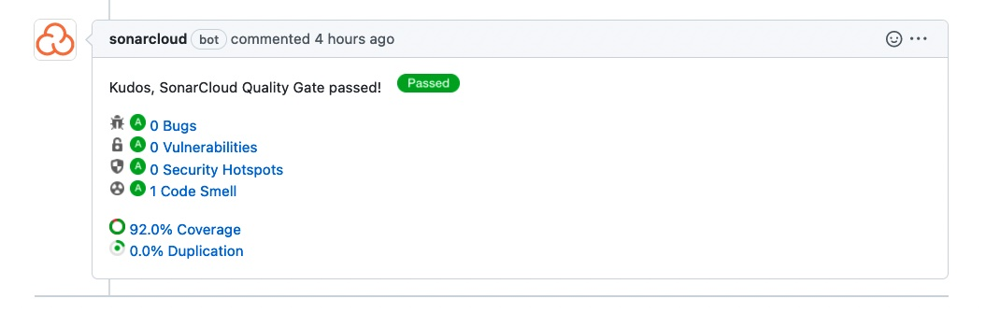

# Static Application Security Testing 

Analyzing the source code before compilation provides a highly scalable method of
security code review and helps ensure that secure coding policies are being followed.

## SonarQube

SonarQube is an open-source platform that helps teams manage code quality. 
It provides a centralized location for developers to analyze and manage their code's quality and security, 
and detect bugs, vulnerabilities, and potential issues in the codebase. 
The platform supports multiple programming languages, 
and it offers a range of features including code analysis, 
coverage, duplication detection, and code smell detection. 
It also offers integration with various build systems and continuous integration tools, 
making it easier to incorporate code quality checks into your development process. 
Overall, SonarQube helps teams to ensure that their code meets industry standards, 
reducing technical debt and improving the overall quality and maintainability of their codebase.

In the Pull Request, SonarQube will report the quality gate status and the number of new issues.

This should be 95% or higher and 0 Code Smells. If it is lower, you should investigate the issues and fix them.
The SonarQube dashboard will show you the details of the issues.
There are two types of issues: bugs and vulnerabilities.
Bugs are problems in the code that can cause a crash or other unexpected behavior.
Vulnerabilities are problems in the code that can be exploited by an attacker.

## CodeQL

CodeQL is a powerful code analysis tool that allows developers to find security vulnerabilities 
and bugs in their codebase. It was originally developed by Semmle, 
a company acquired by GitHub in 2019, and it is now integrated into GitHub's security features. 
CodeQL uses a semantic code analysis approach to identify patterns and potential issues in code, 
using a custom query language to search for specific vulnerabilities and bugs. 
The platform is designed to work with a wide range of programming languages, 
including C, C++, C#, Java, JavaScript, Python, and more. CodeQL allows developers 
to quickly find and fix vulnerabilities in their codebase, reducing the risk of security breaches 
and other issues. It is a powerful tool for any development team looking to improve the security 
and reliability of their software.

CodeQL should run on every push the main/master branch of the repository.
