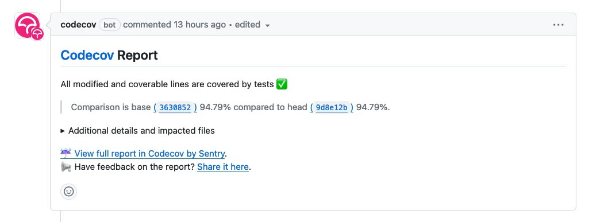

# Codecov

Codecov is a powerful and versatile tool designed to enhance code quality and facilitate effective code coverage analysis in your software development workflow. Code coverage is a critical metric that measures the percentage of code executed during automated testing, providing insights into the effectiveness of your test suite.

Codecov integrates seamlessly with various programming languages, build systems, and CI/CD (Continuous Integration/Continuous Deployment) platforms. By visualizing coverage reports, Codecov helps developers identify untested or poorly tested parts of their codebase, enabling them to make informed decisions to improve code reliability and maintainability.

## PR Builds

On PR builds, there is a status update on how the code coverage is performing.




## codecov.yaml

In the codecov.yaml is the configuration file for codecov [codecov yaml documenation](https://docs.codecov.com/docs/codecovyml-reference)

To check if the configuration is valid:

```
cd <<root of solution>>
curl --data-binary @codecov.yml https://codecov.io/validate
```

