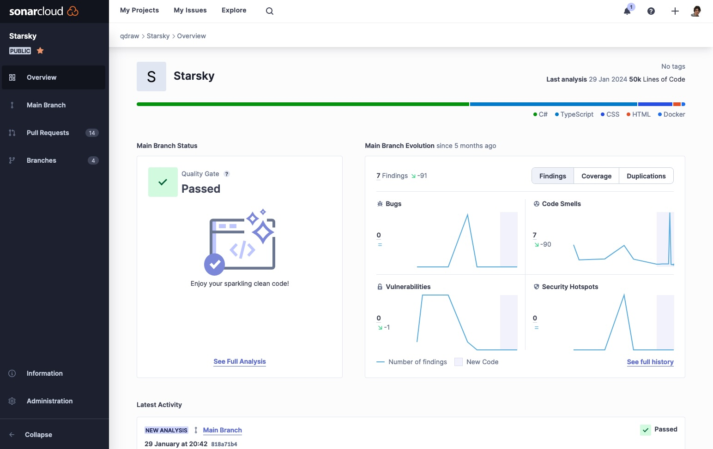
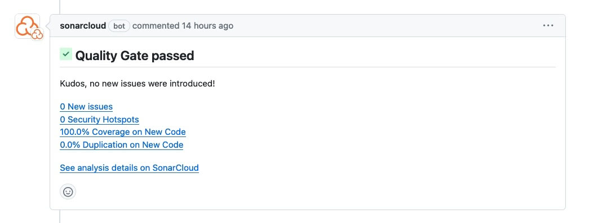

# Sonarcloud

SonarCloud is a static code analysis platform that empowers developers to enhance code quality and maintainability effortlessly. By automatically scanning code for various languages, SonarCloud identifies and flags issues such as bugs, security vulnerabilities, and code smells early in the development process. With its seamless integration into CI/CD pipelines, SonarCloud provides actionable insights, fostering a culture of continuous improvement and enabling teams to deliver more reliable and secure software.

## Code smells & Bugs
The goal is the reduce the amount of code smells and bugs in the repository and add **no** new ones via an PR

## Sonarcloud Dashboard

This should be 95% or higher and 0 Code Smells. If it is lower, you should investigate the issues and fix them.
The Sonarcloud dashboard will show you the details of the issues.
There are two types of issues: bugs and vulnerabilities.
Bugs are problems in the code that can cause a crash or other unexpected behavior.
Vulnerabilities are problems in the code that can be exploited by an attacker.

[Because this is an open source project the Sonarcloud dashboard is public](https://sonarcloud.io/project/overview?id=starsky)

> [See Sonarcloud dashboard here](https://sonarcloud.io/project/overview?id=starsky)

## PR builds

When a build is succesful run you see a new status update by Sonarcloud where there is a summary of the Qualitygate

Important to check:

- New Issues: Bugs or code smells
- Code coverage
- And avoid duplications

