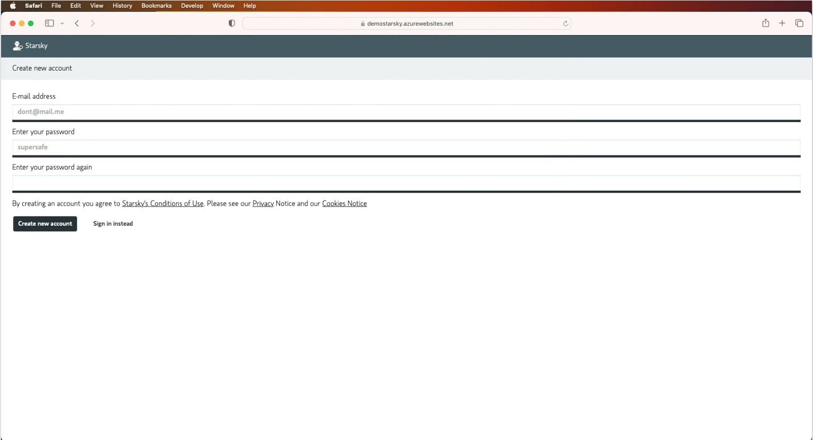
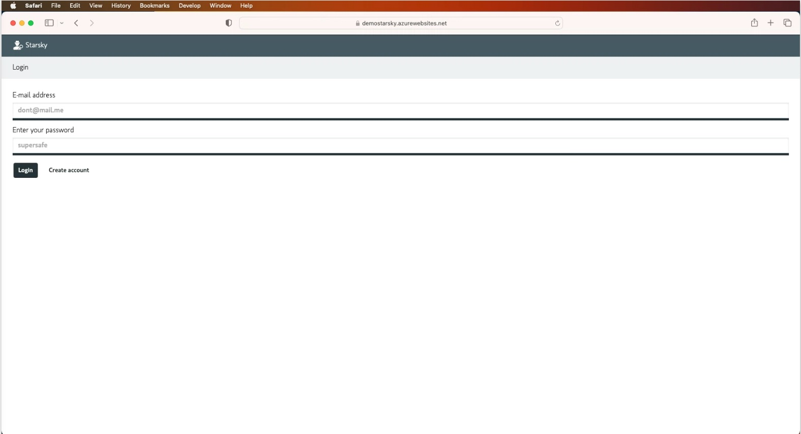
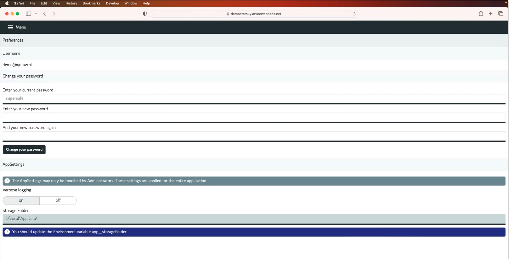

# Account management

For the web application it is possible to manage users

# When first running the Application

When using the Desktop application it is not needed to create a user. 

When first running the application, your email and password will be used to create an account. 
This account will be an admin account. (*)

# Create a new account

The account register page is public visible when there are no users in the database.

When there are users in the database, the account register page is not visible.

At the moment email addresses are not checked for validity. In future versions this will be added.



_Screenshot from: https://demo.qdraw.nl and account/register page_

When the account is created, the user will be redirected to the login page.



_Screenshot from: https://demo.qdraw.nl and account/login page_

# Change password when already logged in

When you are logged in, you can change your password via the preferences page.



_Screenshot from: https://demo.qdraw.nl and preferences page_


## Account management via the CLI

In case you have locked yourself out of the application, you can use the CLI to add yourself as an admin user.
The CLI is a .NET application. It is possible to run it on Windows, Linux and Mac that are included in the releases
Via the `starskyadmincli` it is possible to remove and add accounts.

Run it via your favorite terminal application. In Windows this can be Powershell and Mac OS its the Terminal application.

Go tho the folder where you extracted the release and run the following command:

```bash
starskyadmincli
```

If you start the commandline tools without any arguments, you will see the following options:

```
- What is the username/email?
```

Enter the email address of your account
If you account already exists you will see the following options:
- to toggle rights between user and admin
- to remove your account

If your account does not exist, you will be asked to create an account. 
The same password policy applies as for the web application.

# Default Setting for creating new accounts

When creating a new account, the default settings are that you create a user, non admin account.
You can set the default role for new accounts via the appsettings.json file.
This is the `accountRegisterDefaultRole` setting. This setting can have two values: `user` or `admin`.

```json
{
    "app": {
        "accountRegisterDefaultRole": "user"
    }
}
```
_Only this value in the form of the appsettings.json file, other settings are also needed_

