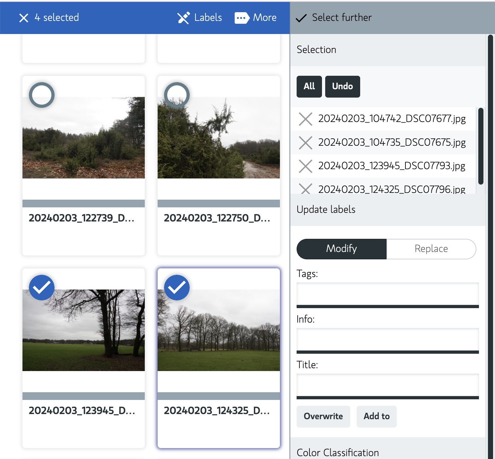

# Bulk editing

Bulk editing is a feature that allows you to edit multiple files at once.
Is it possible to edit the metadata for multiple images at once.
You can use it in search and archive. In detail view you can edit the metadata for a single image.

## 1. Select the images

Via the search or archive you can select multiple images.
Press select and Labels and select the images you want to update.

## Update

When you selected an image you can update the metadata.
You can update the following metadata:

- Tags *(Comma seperated)*
- Info
- Title
- ColorClass (the color label of the image)

via the API you could also update other metadata like:

- Location
- Software
- etc.

The following image shows the bulk editing feature in action:

- So press 'Select' and select the images you want to update:
- Press 'Labels' and update the metadata you want to update.

# Replace the metadata in the fields: tags, info or title

You can search and replace the metadata in the fields: tags, info or title.
Is easy to undo typos or update the metadata.

> Note: Tags are comma separated and unique.
> So when you add a tag that already exists, it will not be added.

# Open files

When using the application as desktop mode you can batch open files with your favorite editor.
See [Desktop Open](../getting-started/configuration/desktop-open.md) for more information.