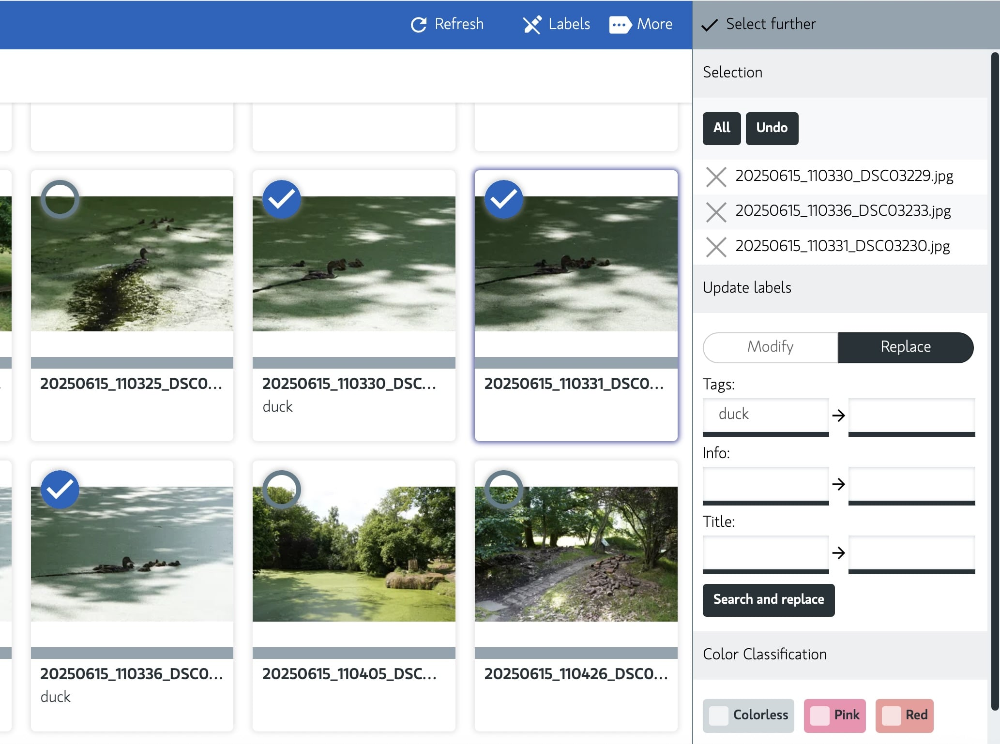

# Bulk editing

Bulk editing is a feature that allows you to edit multiple files at once.
Is it possible to edit the metadata for multiple images at once.
You can use it in search and archive. In detail view you can edit the metadata for a single image.

You can do the following actions in bulk:

- [Update metadata like tags, info, title and color class.](#update)
- [Replace metadata like tags, info, title.](#replace)
- [Open files in your favorite editor.](#open-files)

## Update

Via the search or archive you can select multiple images.
Press select and Labels and select the images you want to update.

When you selected an image you can update the metadata.
You can update the following metadata:

- Tags *(Comma seperated)*
- Info
- Title
- ColorClass (the color label of the image); note: this is always overwritten.

via the API you could also update other metadata like:

- Location
- Software
- etc.

### How to update in batch

To update the metadata in batch, you can use the following steps:

1. Select the images you want to update.
2. Press 'Labels' in the top right corner.
3. Go to 'Update labels' on the right side panel.
4. Fill in the fields you want update.
5. Do one of the two:
    - Press 'Add to' to append the keywords, info or description.
    - Press 'Overwrite' to remove the existing the metadata, only if the field is not empty.
6. You see the changes applied on the left side of the screen.

## Replace

You can search and replace the metadata in the fields: tags, info or title.
Is easy to undo typos or update the metadata.

> Note: Tags are comma separated and unique.
> So when you add a tag that already exists, it will not be added.
> Note: The replace function will not remove the existing metadata, it will only replace the value.
> If you want to remove the existing metadata, you can use the update function with the 'Overwrite'
> option.

### How to replace in batch?

To search and replace the metadata, you can use the following steps:

1. Select the images you want to update.
2. Press 'Labels' in the top right corner.
3. Go to 'Update labels' on the right side panel.
4. Click on the 'Replace' toggle button.
5. Fill in the fields you want to search for and on the right the value to replace to.
6. Press 'Replace' button to replace the metadata in the selected images.
7. You see the changes applied on the left side of the screen.

## Open files

When using the application as desktop mode you can batch open files with your favorite editor.
See [Desktop Open](../getting-started/configuration/desktop-open.md) for more information on how to
configure.

### How to open files in batch?

To open files in batch, you can use the following steps:
This **only** works in the **desktop mode** of the application.

1. Select the images you want to edit.
2. Press **Command + E (Mac)** or **Control + E (Windows/Linux)** to open the files.

> Note: This will open the files in your default image editor.

If you want to open the files in a specific editor, you can configure the editor in the settings.
See [Desktop Open](../getting-started/configuration/desktop-open.md) for more information.

> Note: This works also in the detailed view, so you can open a single file in your editor.
> Use the same shortcut Command + E (Mac) or Control + E (Windows/Linux) to open the file.