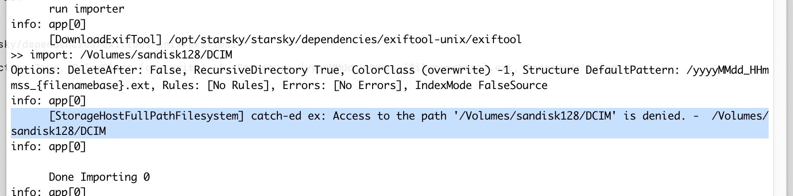
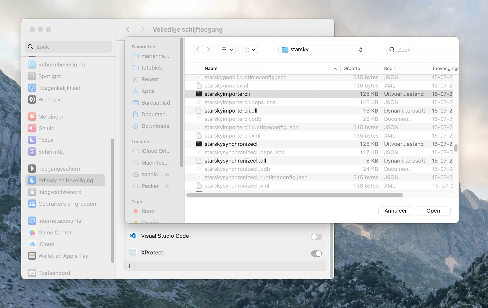

# Import

With the import tool, you can now import from a camera or SD card (or anywhere on your computer) to
the application library.
We've also added a new feature - autofill datetime based on EXIF data. EXIF data is the data that is
stored in the image file.

Transferring the photos and videos from your camera to your photo library is not complicated, but
often a manual task.
Yet this is easy to automate. You connect your SD card or USB cable and the computer does the rest
of the process independently.
If your photo library has more structure, for example by organizing the photos by date, you can also
configure this in the settings.


Import is by default done by the metadata field that contains the datetime the picture is made
If that field is not available, the file creation date is used.
When the metadata isn't available it will try to read the date from the filename.

## Conditional Import Configuration

The `Import` system in Starsky has been enhanced to support **conditional rules** for both:

- Setting the **folder structure** dynamically based on image metadata
- Assigning a **ColorClass** at import time based on conditions

This is a **breaking change** from the previous version, where the folder structure was a single
flat string. You must now use the new rule-based configuration format.

---

## 📂 Structure Rules

You can now define rules that dynamically determine the import path structure based on image
metadata, such as image format or origin. This is configured using the `Structure` object.

### 🔧 Configuration Example

```json
{
    "Structure": {
        "DefaultPattern": "/yyyy/MM/yyyy_MM_dd*/yyyyMMdd_HHmmss_{filenamebase}.ext",
        "Rules": [
            {
                "Conditions": {
                    "ImageFormats": ["png"]
                },
                "Pattern": "/yyyy/MM/yyyy_MM_dd*/\\screen\\sho\\t/yyyyMMdd_HHmmss_{filenamebase}.ext"
            },
            {
                "Conditions": {
                    "Origin": "test"
                },
                "Pattern": "/yyyy/MM/yyyy_MM_dd_\\t/yyyyMMdd_HHmmss_{filenamebase}.ext"
            }
        ]
    }
}
```

### 📘 Explanation

- `DefaultPattern`: The fallback pattern used when no rules match.
- `Rules`: An array of conditional structure overrides.
- `Conditions`: Metadata that must match to apply the `Pattern`.

#### Supported `Conditions`

- `"ImageFormats"`: List of formats (e.g. `"png"`, `"jpg"`)
- `"Origin"`: A string passed through by the importer or calling service

#### Pattern Placeholders

| Placeholder             | Description                            |
| ----------------------- | -------------------------------------- |
| `{filenamebase}`        | Original filename without extension    |
| `.ext`                  | File extension, including the dot      |
| `yyyy`, `MM`, `dd`, etc | Date parts based on file creation date |

---

## 🎨 ImportTransformation Rules

You can also define rules to assign a `ColorClass` to images automatically upon import, based on the
same metadata.

### 🔧 Configuration Example

```json
{
    "ImportTransformation": {
        "Rules": [
            {
                "Conditions": {
                    "Origin": "test"
                },
                "ColorClass": 2
            },
            {
                "Conditions": {
                    "ImageFormats": ["png"]
                },
                "ColorClass": 2
            }
        ]
    }
}
```

### 📘 Explanation

Each rule checks for matching `Conditions`. If matched, the specified `ColorClass` is applied to the
imported image.

---

## 💥 Breaking Change Notice

The previous import configuration used a flat string:

```json
"Structure": "/yyyy/MM/yyyy_MM_dd/yyyyMMdd_HHmmss_{filenamebase}.ext" // legacy
```

This has been **replaced** by the rule-based system above. Any existing configurations must be
updated to the new format.

---

## ✅ Benefits

- More intelligent imports based on image metadata
- Easier categorization (e.g. screenshots vs DSLR)
- Automate tagging with `ColorClass`
- Test imports can be tracked and stored separately

---

## 📎 Notes

- Rules are evaluated in order; the first matching rule wins.
- If no rules match, the `DefaultPattern` (or no `ColorClass`) is used.
- `Origin` is passed via the API or CLI when importing files.

---

## 🧪 CLI Example with Origin

```bash
starskyimportercli --path "/photos/test" --origin "test"
```

## 📷 CLI Example: Scan for Camera Storages

You can use the `--camera` option with `starskyimportercli` to automatically scan for camera storage devices, such as SD cards, connected to your computer. This is useful for quickly finding and importing from external camera media without manually specifying the path.

**Usage:**

```bash
starskyimportercli --camera --recursive
```

**How it works:**

- When `--camera` is specified, the tool scans for connected camera storage devices (like SD cards).
- The `--path` option must **not** be specified when using `--camera`.
- It is recommended to also use `--recursive` to ensure all subfolders on the camera storage are included in the import.

**Note:**

- This feature is especially useful for quickly importing all photos and videos from a camera card.
- If both `--camera` and `--path` are provided, the command will not work as expected.

**How camera storage is detected:**

The following checks are performed to identify camera storage devices:

1. Filter writable, ready volumes
2. File system heuristic — FAT or exFAT
3. DCIM folder (standard for cameras)
4. Camera-like directory structure (to search for alternatives)

These 4 checks help ensure that only valid camera storage devices are scanned and imported.

## Troubleshooting: Access to Path is denied on macOS

When you see the error: **Access to Path is denied** on an external memory card, you need to give Starsky Full Disk Access.



### How to grant Full Disk Access on macOS

1. Open **System Settings** (or **System Preferences** on older macOS versions).
2. Go to **Privacy & Security**.
3. Scroll down and select **Full Disk Access**.
4. Click the **+** button and add the Starsky application (or the terminal if you use the CLI).
5. Make sure Starsky and StarskyImporterCli is enabled in the list.
6. Restart Starsky (or your terminal) for the changes to take effect.



This permission is required by macOS to allow applications to access files on external drives and memory cards.

- [Reference](../getting-started/troubleshooting/macos.md).
