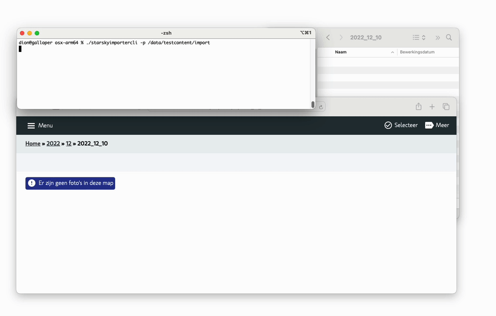

# Import 

Transferring the photos and videos from your camera to your photo library is not complicated, but often a manual task. 
			Yet this is easy to automate. You connect your SD card or USB cable and the computer does the rest of the process independently. 
			If your photo library has more structure, for example by organizing the photos by date, you can also configure this in the settings. 

