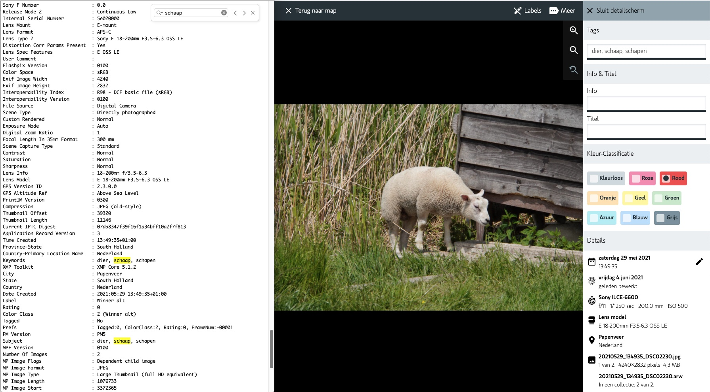

# Super compatible with other tools

Starsky uses IPTC and XMP metadata to read and write. 
That are two standards that every photo organizer should use
So when you remove the database a single rescan will restore the metadata since it is stored inside the images.

When you use other tools to edit XMP or IPTC metadata, Starsky will able to read the changes and display them in the application.

_Left Exiftool viewing image and right Starsky with the same info_

## Which metadata is supported

Starsky uses IPTC or XMP metadata to read and write. 

- Keywords / Tags 
  - where to find the image - used by the search engine to find the image
- Description 
  - what is the image about
- Title
  - what is the image about
- ColorClass
  - Rating and option to sort images very fast
- GPS Latitude and Longitude 
  - where is the image taken
- GPS Altitude
  - how high is the image taken
- City
  - Which city is the image taken
- Country
  - Which country is the image taken
- CountryCode
  - ISO 3166-1 alpha-2 country code of the country the image is taken
- State
  - Which state or province is the image taken
- Software
  - Which software is used to create the image
- Image Height
  - The height of the image
- Image Width
  - The width of the image
- Orientation
  - The orientation of the image
- DateTime
  - The date and time the original image was taken
- ISO speed
  - The ISO speed of the image
- Aperture
  - The aperture of the image
- Shutter speed
  - The shutter speed of the image
- Focal length
  - The focal length of the image
- Make
  - The make brand of the camera
- Model
  - The model of the camera
- Lens
  - The lens of the camera
- Image Stabilization
  - If the image is stabilized (only for Sony cameras)
