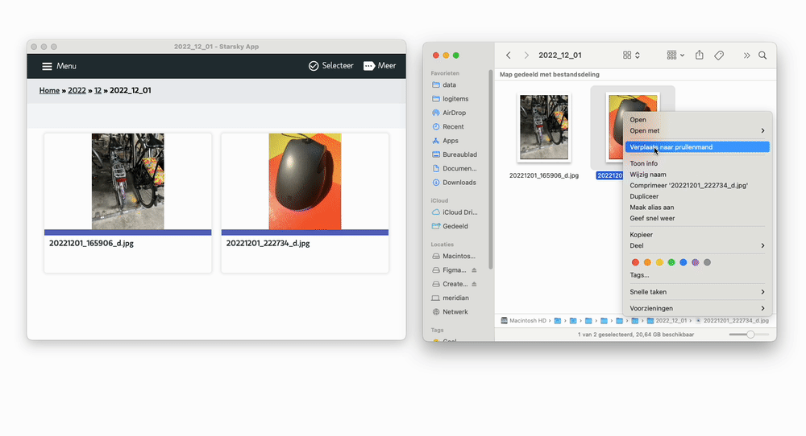

# Realtime updates

The app gives you real-time updates of the view of your image software, 
so you never have to worry about missing new pictures or videos that have been uploaded. 
Just download the app, upload a picture or video, and watch it come up in real time!

The user interface is updated via a websocket interface. This means that users are always up-to-date

## Upload photos and view it realtime

Bellow there is an example of a user uploading photos and viewing it realtime in the user interface.

_Left iOS Safari view, right Firefox and bottom Chrome_

The application is designed to work on mobile devices. The user interface is responsive and works on all devices.
With the setting `useRealtime` you can disable the realtime updates. This useful when your webserver does not support websockets.

## Realtime updates from your hard disk (File system watcher)

The application uses a filesystem watcher to detect changes. 
This means that when you add or edit photos on disk, 
the application will detect the changes and update the user interface.
With the setting `useDiskWatcher` you can disable the disk watcher. 

In order to use the disk watcher the application needs access to the entire folder, 
when this is not the case the disk watcher will not work.

_Realtime updates from your hard disk_
