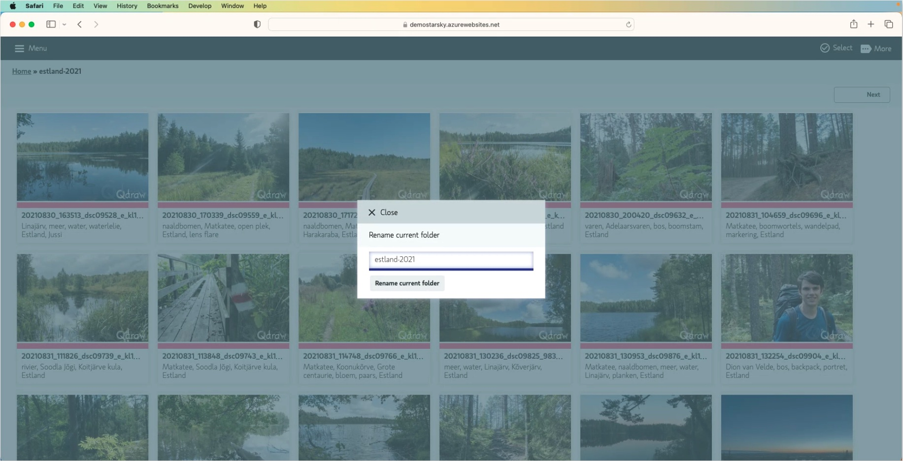

# Rename photos

You can rename and sort your photos in simple steps, which is easier than ever before.

Ever wish you could rename a folder in your photo management tool? 
Well, now you can with Starsky. Go in the user interface to More and Rename and enter the new name of the folder.
It will update instantly, making it easier than ever to organize your photos.

## You can find in the top menu the option to rename the folder.
From the user interface it is possible to rename folders and images
Use the **More** button on the right top to rename a folder or image

_Screenshot from: https://demo.qdraw.nl and ?f=/estland-2021 page_
