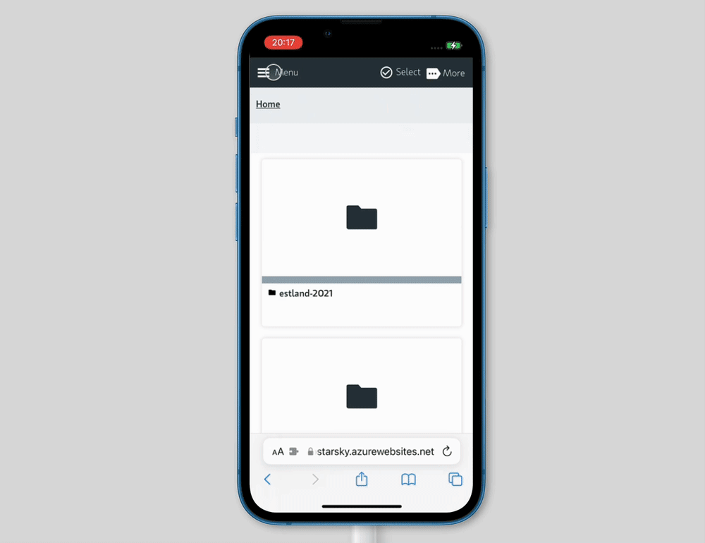

# Search

Search and find photos based on keywords through the whole photo library.

_Screenshot from: https://demo.qdraw.nl and `search?t=wolken` page_

## A Painless Search Pane

Make the challenge of hunting for files a thing of the past with the new Advanced Search feature.
Choose from numerous search criteria, including XMP Metadata
and EXIF & IPTC fields. Built-in logic for AND/OR states
let you narrow down results to a microscopic level.

## Unrivalled Digital Asset Management

Searching for files in ACDSee Photo Studio for Mac is like a dream. 
Finding, sorting, moving, organizing, and sharing—everything 
you need for complete mastery over your photography workflow is right here, 
at your fingertips. No uploading or importing of images needed. 

Add ratings, tags, location data and (customizable) color labels 
to your files for easy sorting. Manage the people in your photos 
and search by person to effortlessly recall special moments. 
Keep a closer eye on your data with the Info Palette.

