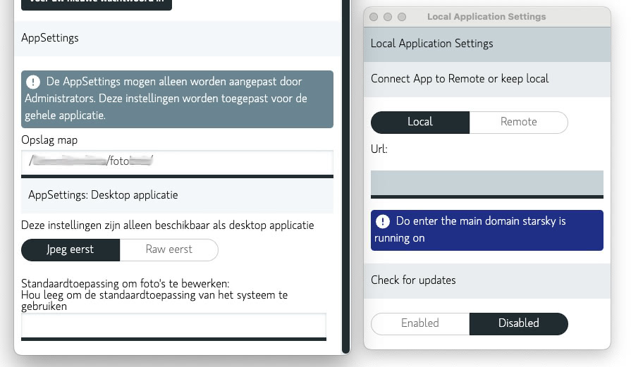

# Configure Open With

There are two options to use the desktop application

- Remote (So the back-end is not running on your local machine)
- Local / As Desktop

If you don't know you are using the local one, you can check the settings in the desktop
application.

When using remote, the application will open the image in the default application.
Then there are no settings to configure overwrites.

Left: The settings are not available in a remote environment
Right: To check if using remote or local (using the desktop application)



## Local / As Desktop

The following settings are for Local / As Desktop.
The UI writes the settings to the `appsettings.patch.json` file.

You can use the `appsettings.patch.json` file to configure the desktop application
or use the Settings in the web application.

### DefaultDesktopEditor

This setting is done by ImageFormat,
an imageFormat is defined by the first bytes of the file.

In the UI there is an option to set the default application for a few photo formats.

> Note: If you enter an invalid ApplicationPath location: The application will open the file with
> the system default application

```json
{
    "DefaultDesktopEditor": [
        {
            "ApplicationPath": "/Applications/Adobe Photoshop 2020/Adobe Photoshop 2020.app",
            "ImageFormats": ["jpg", "bmp", "png", "gif", "tiff"]
        }
    ]   
}
```

### Collections / Stacks

When opening an image from a collection/stack, the desktop application will one of both files
A collection is for example two files in one folder: `2021-01-01-IMG_1234.jpg`
and `2021-01-01-IMG_1234.dng`
The default display is to show the jpeg first.

> Note: The default setting is to open the jpeg file first

### Raw First

So the raw file will be open if available

```json
{
    "DesktopCollectionsOpen": "2"
}
```

### Jpeg first

If the raw file is available, the jpeg file will be open first

```json
{
    "DesktopCollectionsOpen": "1"
}
```