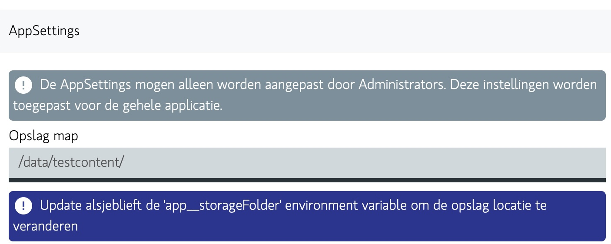

# Desktop Mac OS

# Do I have Apple Silicon or Intel?

If you're using a Mac and you're not sure whether it's an Intel or Apple Silicon Mac, you can check
by clicking on the Apple logo in the top-left corner of your screen, then selecting "About This
Mac." In the window that pops up, it will tell you which type of processor your Mac has.
If you bought your Mac recently (after 2020), it's more likely to be an Apple Silicon Mac. If it's
an older model, it's probably an Intel Mac.

The difference is:
An Intel Mac is a type of computer made by Apple that uses processors (the brain of the computer)
made by Intel, a company that specializes in making computer components. An Apple Silicon Mac is
also a computer made by Apple, but it uses processors designed and developed by Apple itself, known
as Apple Silicon chips.

# Download page

Click on the Apple Silicon or Intel option:

[](https://docs.qdraw.nl/download)

Op the dmg file from downloads:

- `starsky-mac-arm64-desktop.dmg` - Apple Silicon Macs
- `starsky-mac-x64-desktop.dmg` - Intel Macs


## Installer step 2

Drag the Starsky App into Applications


## Wait for the installer is done


## Open Terminal

Do code signing yourself or and remove from quarantine with the following command:

```
codesign --force --deep -s - /Applications/Starsky.app && xattr -rd com.apple.quarantine /Applications/Starsky.app
```

**You need to manually sign the code because we haven't purchased certificates from Apple**

## Installer is done

Click on Applications and open the App there

> Note: Do NOT open the application inside the DMG file this does not work


## It runs

See the [First Steps in the Getting Started Guide](../first-steps.md) for more info on how to setup
the storage folder

[](https://docs.qdraw.nl/docs/getting-started/first-steps)

_[Read more in the First Steps](../first-steps.md)_

## Error case: To open Starsky, you need to install Rosetta. Do you want to install it now?

Rosetta is used to translate Intel instructions into Apple Silicon instructions.
You have properly downloaded the wrong version.

Op the dmg file from downloads:

- `starsky-mac-arm64-desktop.dmg` - Apple Silicon Macs

The message looks like this:


