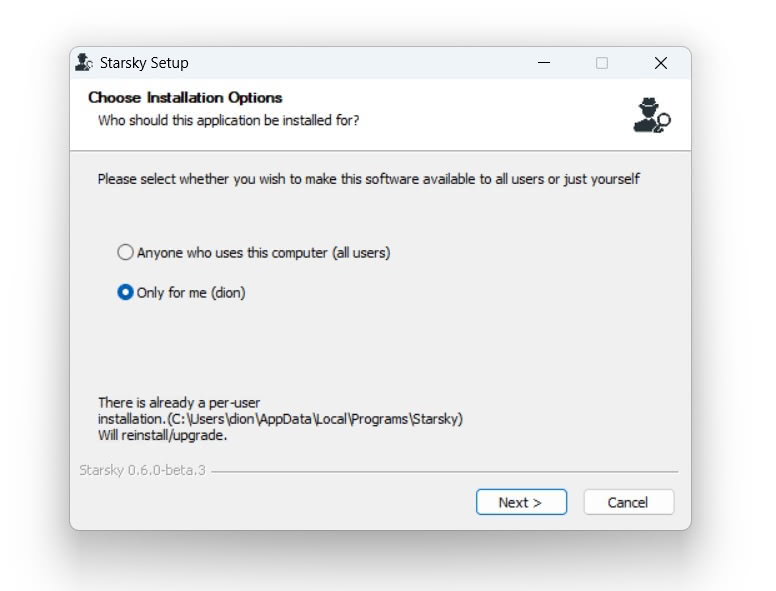
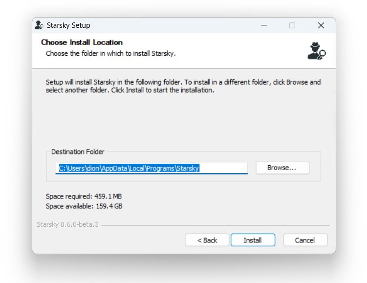
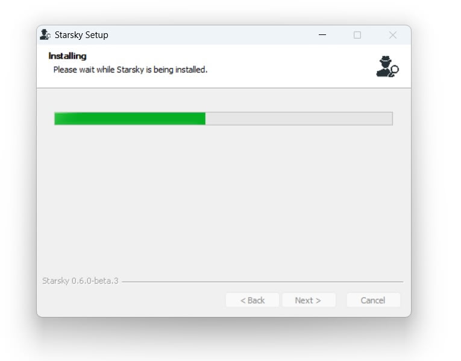
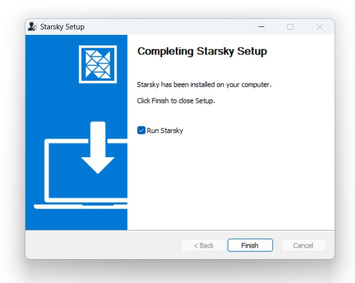

# Windows

## Installer step 1

Open the downloaded installer: `starsky-win-x64-desktop.exe`

Can you install it globaly or in your own user space. The default option is "Only for me"

## Installer step 2

This is the default location when installing "Only for me"

## Wait for the installer is done

## Installer is done

## It runs

See the [First Steps in the Getting Started Guide](../first-steps.md) for more info on how to setup the storage folder
