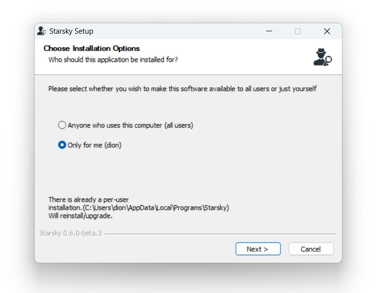
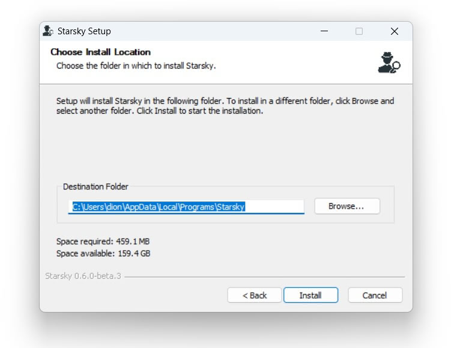
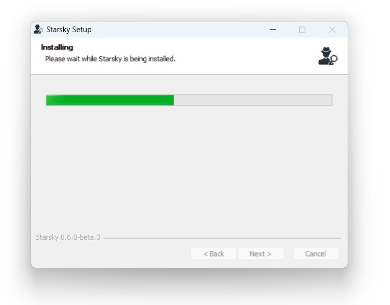
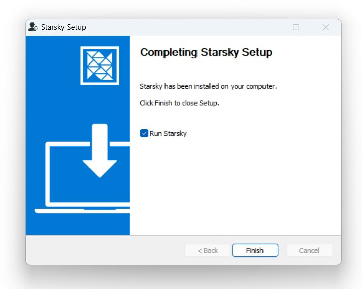

# Windows

The Windows desktop app is a native WPF application that embeds the Starsky web UI via Microsoft WebView2. It bundles the full Starsky server and launches it automatically in the background — no separate server setup is needed.

## Requirements

- Windows 10 or later (64-bit)
- Microsoft WebView2 Runtime — pre-installed on Windows 11; on Windows 10 it is usually already present via Edge, but can be installed separately from [Microsoft's site](https://developer.microsoft.com/en-us/microsoft-edge/webview2/)

## Installer step 1

Open the downloaded installer: `starsky-win-x64-desktop.exe`

Can you install it globaly or in your own user space. The default option is "Only for me"



## Installer step 2

This is the default location when installing "Only for me"



## Wait for the installer is done



## Installer is done



## It runs

See the [First Steps in the Getting Started Guide](../first-steps.md) for more info on how to set up
the storage folder

## Connection modes

The Windows app supports two modes, switchable in Settings:

- **Local** — starts the bundled Starsky server on a free port; no login is required (intended for single-user desktop use)
- **Remote** — connects to an existing Starsky server URL; full authentication applies

## Automatic updates

The app checks for updates on startup and will prompt you when a new version is available. You can postpone the update; the check is suppressed for 4 days after dismissing a prompt. Update checking can be disabled in Settings.

## Mount Watcher

Mount Watcher is an optional background Windows Service that watches for connected camera storage (SD cards, USB cameras) and triggers an automatic import when one is detected.

**To enable:**

1. Open the **Settings** menu in the menu bar
2. Hover over **Mount Watcher**
3. Click **Enable Mount Watcher (requires admin)**
4. Approve the Windows UAC consent dialog that appears
5. The submenu updates to show **Status: Running**

**To disable:** open the same submenu and click **Disable Mount Watcher** (another UAC dialog appears).

The preference is saved to `%AppData%\starsky\settings.json`. When the app starts and Mount Watcher is enabled, it automatically reinstalls and starts the service — no UAC prompt on startup. If the service cannot be installed (for example the bundled binary is missing), the preference is cleared automatically.

> The app itself does not run with elevated privileges. Only the `starskymountwatchercli.exe` sub-process is elevated for the duration of service registration.

See [Mount Watcher CLI](../../features/import/mountwatchercli.md) for details on what the service does and how camera detection works.

## Advanced: custom installation directory

By default the installer places the application in `%LocalAppData%\Starsky.Desktop`. To install to a different location, run the setup from the command line with the `--installto` flag:

```powershell
starsky-win-x64-desktop.exe --installto "D:\Apps\Starsky"
```

The directory will be created if it does not exist. All Velopack update mechanics (auto-update, uninstall) continue to work from the custom location.

## Data locations

| Purpose | Path |
|---|---|
| Application binaries | `%LocalAppData%\Starsky.Desktop\current\` (default) |
| Settings | `%AppData%\starsky\settings.json` |
| Logs | `%AppData%\starsky\logs\` |
| Database (local mode) | `%AppData%\starsky\starsky.db` |
| Thumbnails (local mode) | `%AppData%\starsky\thumbnailTempFolder\` |
| Temp files (local mode) | `%LocalAppData%\starsky\tempFolder\` |
