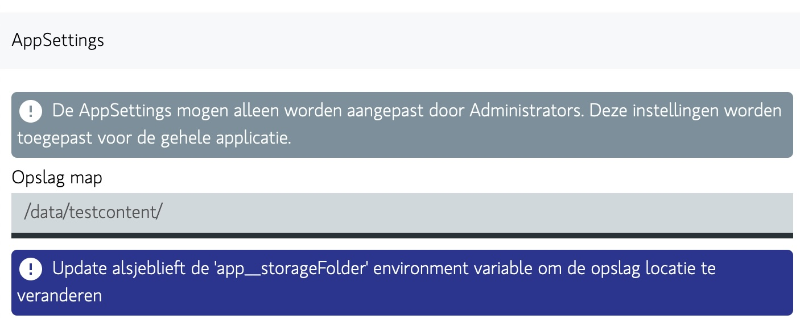
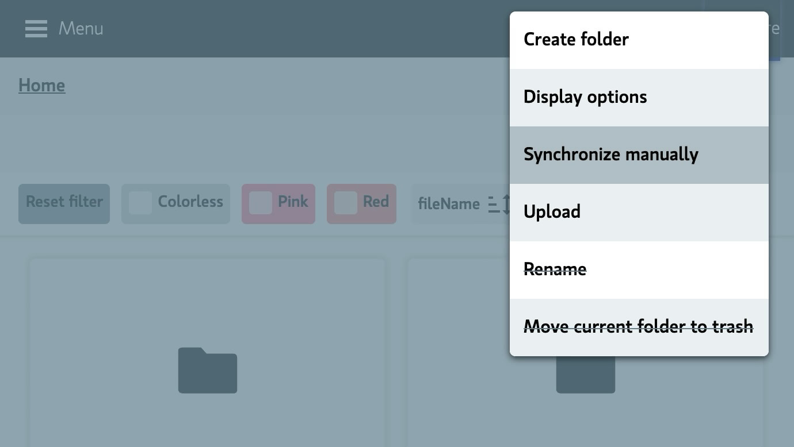
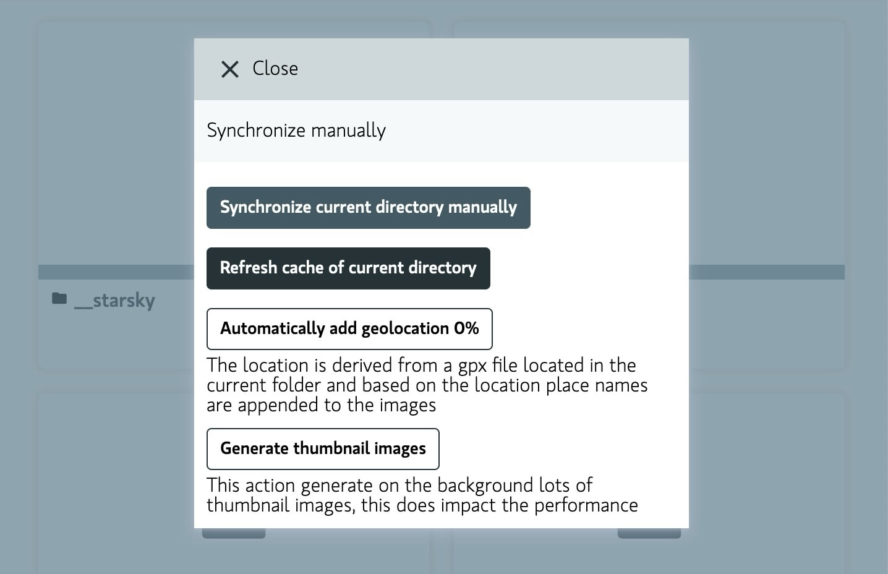
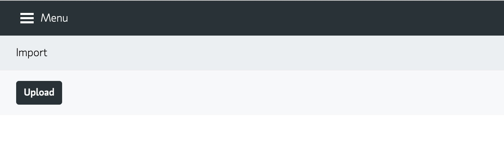

# First steps

Welcome to the first steps of your journey with Starsky!

## Setting Storage Folder

- Once you have installed Starsky, you can start it by opening the Starsky application.
- Go to Preferences and change the Storage Folder's path to the location where you want to store
  your pictures.
- Press Command + Shift + K on Mac OS and Ctrl + Shift + K on Windows to go to Preferences.
- This looks like this:

> Note: AppSettings can only be edited by Administrators, the first user is by default Administrator

> Note: When using an environment variable, the path is not editable in the UI

When using as server mode: [see account management for more info](../features/accountmanagement.md)

## Run re-sync

- After setting the Storage Folder, you can run a re-sync to update the view with the new location.
- Go to the Home screen
- Press More on the right top
- Click Synchronize manually
- This looks like this:

- Press Synchronize current directory manually

- Wait until the sync is finished

## Importing photos

- After the sync is finished, you can start importing photos.
- Go to the Home screen
- In menu click on Import
- This looks like this:

The default structure is `/yyyy/MM/yyyy_MM_dd/yyyyMMdd_HHmmss_{filenamebase}.ext` and the photos are
placed in the correct folder.
So a picture that has been taken at `Saturday, 3 February 2024 10:10:29` will be placed
in `2024/02/2024_02_03` and will be named: `20240203_101029_DSC07624.jpg` the base name of the file
is `DSC07624` and the extension is `jpg`.

Read more about [Import here](../features/import.md)

## Search

Learn more about search [Search here](../features/search.md)