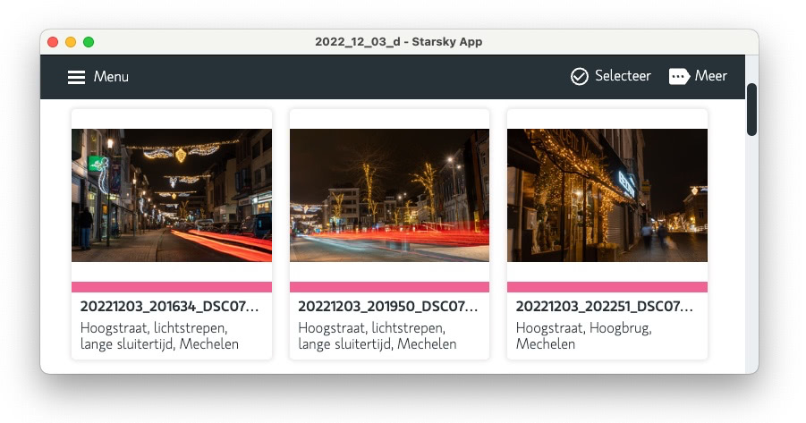

import Button from "@site/src/components/button";

# Getting Started

Starsky is an Photos App for the Decentralized Web. It makes use of the latest technologies to tag and find pictures automatically without getting in your way. You can run it at home, on a private server, or in the cloud.

## Feature Overview

Our mission is to provide the most user- and privacy-friendly solution to keep your pictures organized and accessible. That's why Starsky was built from the ground up to run wherever you need it, without compromising freedom, privacy, or functionality:

-   Browse all your photos and videos, duplicates or video formats
-   Easily find specific pictures using powerful search filters
-   Since the User Interface is a Progressive Web App, it provides a native app-like experience,
    and you can conveniently install it on the home screen of all major operating systems and mobile devices
-   Metadata is extracted and merged from Exif, XMP
-   One click import files to the libary.
-   Use Syncthing to keep databases synced a cross multiple computers

## 100% Privacy 🔒

Because Starsky is 100% self-funded and independent, we can promise you that we will never sell your data and that we will always be transparent about our software and services. Your data will never be shared with Google, Amazon, Microsoft or Apple unless you intentionally upload files to one of their services.

<Button href="https://demo.qdraw.nl" color="#25c2a0">
    Try our Demo
</Button>

<Button href="getting-started" color="#25c2a0">
    Getting started
</Button>
