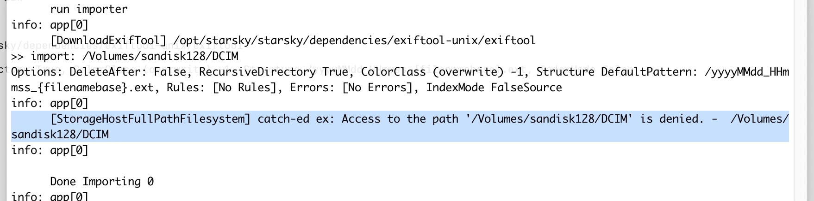
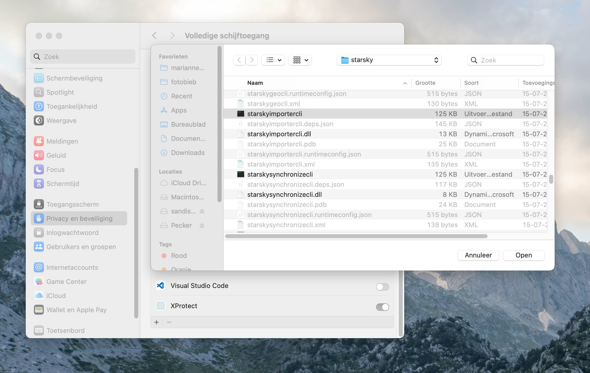

# Solving macOs-Specific Issues

## Troubleshooting: Access to Path is denied on macOS

When you see the error: **Access to Path is denied** on an external memory card, you need to give Starsky Full Disk Access.

### How to grant Full Disk Access on macOS

1. Open **System Settings** (or **System Preferences** on older macOS versions).
2. Go to **Privacy & Security**.
3. Scroll down and select **Full Disk Access**.
4. Click the **+** button and add the Starsky application (or the terminal if you use the CLI).
5. Make sure Starsky and StarskyImporterCli is enabled in the list.
6. Restart Starsky (or your terminal) for the changes to take effect.

This permission is required by macOS to allow applications to access files on external drives and memory cards.

- [Reference](../../features/import.md).