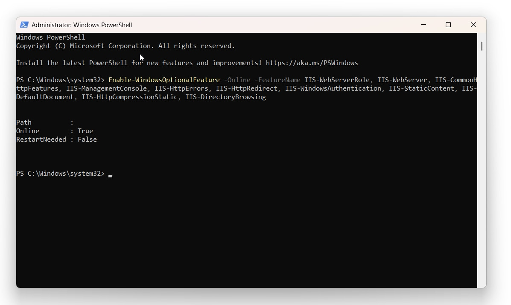
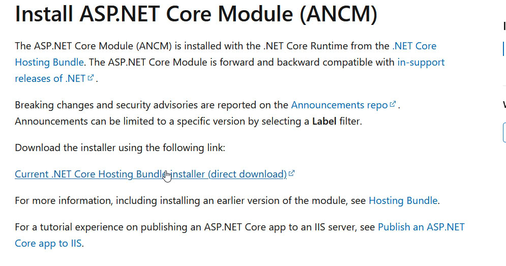
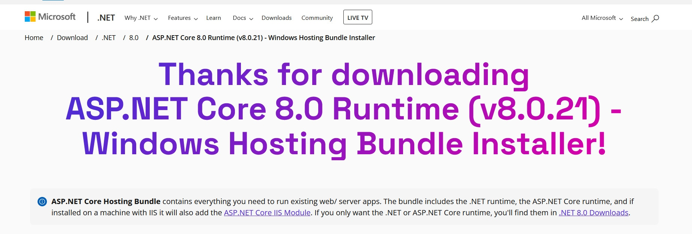

# IIS

This guide explains how to set up and configure IIS (Internet Information Services) to run Starsky on Windows as a server. It covers enabling required Windows features, installing necessary modules, and preparing folders for application storage. Follow these steps to get Starsky running on IIS for production or development use.

> This guide is work in progress


Run the following command as Administrator
Go to Powershell and right click 'Run as Administrator'

```powershell
Enable-WindowsOptionalFeature -Online -FeatureName IIS-WebServerRole, IIS-WebServer, IIS-CommonHttpFeatures, IIS-ManagementConsole, IIS-HttpErrors, IIS-HttpRedirect, IIS-WindowsAuthentication, IIS-StaticContent, IIS-DefaultDocument, IIS-HttpCompressionStatic, IIS-DirectoryBrowsing
```



## Installing AspNetCoreModule (ANCM)

To run ASP.NET Core applications on IIS, you need the AspNetCoreModule (ANCM) installed. This module is included with the .NET Hosting Bundle, which you can download from the official Microsoft .NET website.



1. **Download the .NET Hosting Bundle**
   - Go to the official [.NET download page](https://dotnet.microsoft.com/en-us/download/dotnet).
   - Download the Hosting Bundle for the version of .NET we use
   - See the [Advanced options](../../advanced-options/starsky/readme.md) for the right version. E.g. `Get the dotnet * SDK`
   - Run the installer and follow the instructions.

   
   _Note the version in the image is not updated_

2. **Verify ANCM Installation**
   - After installation, you can verify the module is present by running the following commands in an elevated command prompt:

   ```powershell
   cd  C:\Windows\System32\inetsrv
   .\appcmd.exe  install module /name:AspNetCoreModule /image:%windir%\system32\inetsrv\aspnetcore.dll
   ```


If you encounter issues, such as the module not appearing in IIS, refer to the [Stack Overflow discussion](https://stackoverflow.com/questions/57878610/aspnetcoremodulev2-missing-from-iis-modules-after-running-the-runtime-bundle) for troubleshooting tips.

