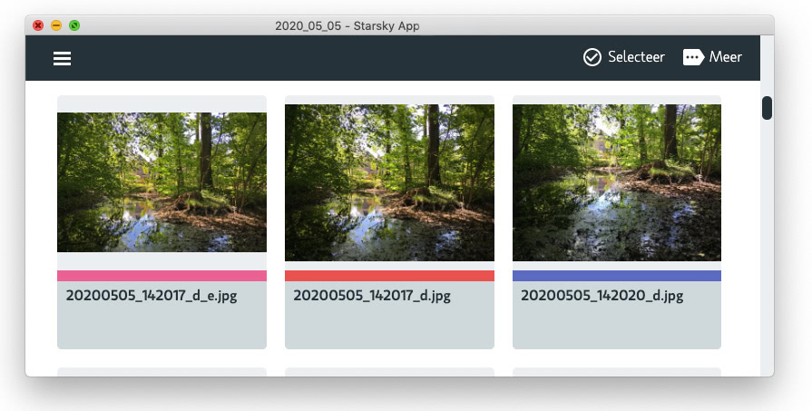

> Go to the [project details](readme.md)

# What is Starsky? (an introduction)

Accelerator to find and organize images driven by meta information. Browse and search images in your own cloud. Starsky is the name of the Starsky DAM (Digital asset management) system that runs as a web service.
You could add how to add users, set up your archives, upload content, control metadata requirements, share content and more.

Starsky helps you get more value from creative digital assets like images and videos by making them easy to organize, access and distribute. The focus of the application is an individual’s digital file library or a photographer’s photo database.

This Digital asset management-tool offers an effective solution for people to store, organize, find, retrieve and share digital content. Quick to deploy and easy-to-use, a centralized digital library access to digital assets—including images, photos, creative files, video and more. [Read more about the install options](readme.md)

## Demo app
There is a online demo of the Starsky Application. You can create unlimited accounts but all input and data will be deleted after restarting. Heroku quits the application after 30 minutes of inactivity. Email addresses in the demo environment are not stored. [Starsky Demo App Account Register](https://starskydemo.herokuapp.com/account/register)

# Main features

## Server
To run in connected mode and collaborate use the server version. There are [install instructions for the server](starsky/readme.md) available.

## Desktop app
There is an Desktop available in Alpha status. This app runs the server application local. There are [install instructions for the desktop app](starskyapp/readme.md) available.

## Indexing
A primary function of a DAM system is to make assets easily available to its users by providing a searchable index that supports retrieval of assets by their content and/or metadata. The cataloging function is usually part of the ingestion process for new assets. Read more about

## Creation
Applications implement digital asset management by importing media types

## Access control
The application includes security controls ensuring relevant people have access to assets.

## Workflow
Export smaller images and generation of templates is one of the features

## Starsky on Mac OS

# Open Source project
Starsky is an open source project that can be used for free. Free as in Speech.

# History
[There is an changelog to see the recent changes](history.md)
