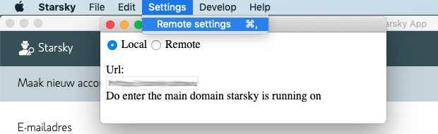

# Starsky App
## List of [Starsky](../readme.md) Projects
 * [inotify-settings](../inotify-settings/readme.md) _to setup auto indexing on linux_
 * [starsky (sln)](../starsky/readme.md) _database photo index & import index project)_
    * [starsky](../starsky/starsky/readme.md) _web api application / interface_
      *  [clientapp](../starsky/starsky/clientapp/readme.md) _react front-end application_
    * [starskySyncCli](../starsky/starskysynccli/readme.md)  _database command line interface_
    * [starskyImporterCli](../starsky/starskyimportercli/readme.md)  _import command line interface_
    * [starskyGeoCli](../starsky/starskygeocli/readme.md)  _gpx sync and reverse 'geo tagging'_
    * [starskyWebHtmlCli](../starsky/starskywebhtmlcli/readme.md)  _publish web images to a content package_
    * [starskyWebFtpCli](../starsky/starskywebftpcli/readme.md)  _copy a content package to a ftp service_
    * [starskyAdminCli](../starsky/starskyadmincli/readme.md)  _manage user accounts_
    * [Starsky Business Logic](../starsky/starskybusinesslogic/readme.md) _business logic libraries (netstandard 2.0)_
    * [starskyTest](../starsky/starskytest/readme.md)  _mstest unit tests_
 * [starsky.netframework](../starsky.netframework/readme.md) _Client for older machines_
 * [starsky-tools](../starsky-tools/readme.md) _nodejs tools to add-on tasks_
 * __[starskyapp](../starskyapp/readme.md) Desktop Application (Pre-alpha code)__

## Usage instructions

There are currently no binary releases but if you have followed the build instructions.

The following versions are available:


> Mac OS 10.10 and 10.11 Are only supported in remote mode

The application bundle can run portable

## Remote mode

Use the settings menu to update the server settings


_In a future release this ugly layout will change_

## Cache

The Electron stores it's cache in these folders:

Windows:
`C:\Users\<user>\AppData\Roaming\starsky\Cache`

Linux:
`~/.config/starsky/Cache`

OS X:
`~/Library/Application Support/starsky/Cache`


## Build instructions

The following steps are needed to compile the desktop application

## Install Node packages
```
npm ci
```

## Building Starsky as dependency first

### For Windows

We assume that you run on a 64 bits windows version

_When running bash_
```bash
../starsky/build.sh --Runtime=win7-x64
```

For Windows there is a bundle created: `starsky/starsky-win7-x64.zip` and this is coppied to the desktop application

### For Mac OS

_When running bash_
```bash
../starsky/build.sh --Runtime=osx.10.12-x64
```

For Mac OS there is a bundle created: `starsky/starsky-osx.10.12-x64.zip` and this is coppied to the desktop application

## Build Electron

### For Windows

We assume that you run on a 64 bits windows version

_When running bash_
```bash
npm run windows
```

### For Mac OS

_When running bash_
```bash
npm run mac
```
