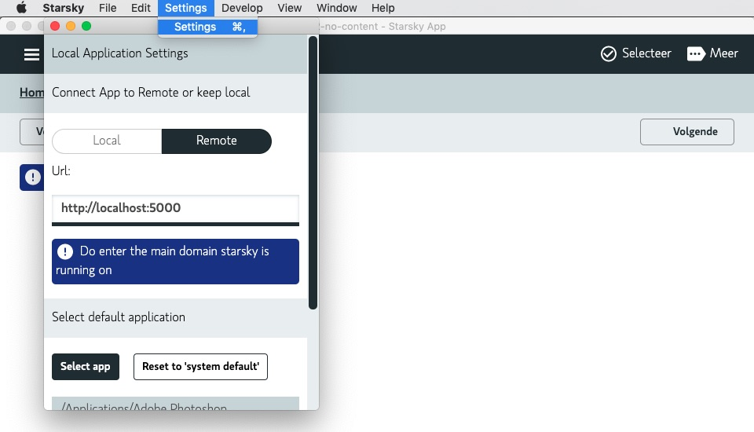

# Starsky App
## List of [Starsky](../readme.md) Projects
 * [starsky (sln)](../starsky/readme.md) _database photo index & import index project)_
    * [starsky](../starsky/starsky/readme.md) _web api application / interface_
      *  [clientapp](../starsky/starsky/clientapp/readme.md) _react front-end application_
    * [starskyImporterCli](../starsky/starskyimportercli/readme.md)  _import command line interface_
    * [starskyGeoCli](../starsky/starskygeocli/readme.md)  _gpx sync and reverse 'geo tagging'_
    * [starskyWebHtmlCli](../starsky/starskywebhtmlcli/readme.md)  _publish web images to a content package_
    * [starskyWebFtpCli](../starsky/starskywebftpcli/readme.md)  _copy a content package to a ftp service_
    * [starskyAdminCli](../starsky/starskyadmincli/readme.md)  _manage user accounts_
    * [starskySynchronizeCli](../starsky/starskysynchronizecli/readme.md)  _check if disk changes are updated in the database_
    * [starskyThumbnailCli](../starsky/starskythumbnailcli/readme.md)  _speed web performance by generating smaller images_
    * [Starsky Business Logic](../starsky/starskybusinesslogic/readme.md) _business logic libraries (netstandard 2.0)_
    * [starskyTest](../starsky/starskytest/readme.md)  _mstest unit tests_
 * [starsky.netframework](../starsky.netframework/readme.md) _Client for older machines (deprecated)_
 * [starsky-tools](../starsky-tools/readme.md) _nodejs tools to add-on tasks_
 * __[starskyapp](../starskyapp/readme.md) Desktop Application (Pre-alpha code)__
 * [Changelog](../history.md) _Release notes and history_

## Usage instructions

There are binaries available through  [Github Releases](https://github.com/qdraw/starsky/releases/latest/)

### Windows 7 and newer
- Go to [Github Releases](https://github.com/qdraw/starsky/releases/latest/) and click on `starsky-win-desktop.zip`

### Mac OS 10.12 or newer
- Go to [Github Releases](https://github.com/qdraw/starsky/releases/latest/) and click on `starsky-mac-desktop.zip`

The following versions are available:


The application bundle can run without installer

### Gatekeeper

Since we don't have certificates from Apple, users are warned. If you don't trust it, the code is public and its instructions for building it

When you see the following warning:


 Open app without Gatekeeper

-   From the Apple menu, open the "System Preferences" application.
-   Click on Security & Privacy > General tab.
-   Look at 'Allow apps downloaded from' and click button 'Open Anyway'

## Remote mode

Use the settings menu to update the server settings
Click on 'Settings' > 'Settings' to get the following menu



## Cache

The Electron stores it's cache in these folders:

Windows:
```
C:\Users\<user>\AppData\Roaming\starsky\Cache
```

Linux:
```
~/.config/starsky/Cache
```

OS X:
```
~/Library/Application\ Support/starsky/Cache
```

## Build instructions

The following steps are needed to compile the desktop application

## Building Starsky as dependency first

### For Windows

We assume that you run on a 64 bits windows version

_When running bash_
```bash
../starsky/build.sh --Runtime=win7-x64
```

For Windows there is a folder created: `starsky/win7-x64` and this is coppied to the desktop application

### For Mac OS

_When running bash_
```bash
../starsky/build.sh --Runtime=osx.10.12-x64
```

For Mac OS there is a folder created: `starsky/osx.10.12-x64` and this is coppied to the desktop application

## Build Electron

Go the source folder of the application

```
cd starskyapp
```

## Install Node packages
```
npm ci
```

### For Windows

We assume that you run on a 64 bits windows version

_When running bash_
```bash
npm run windows
```

### For Mac OS

_When running bash_
```bash
npm run mac
```
